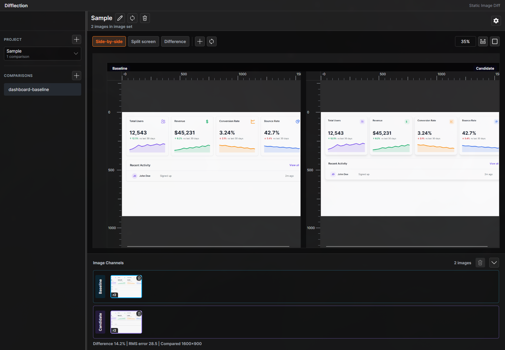
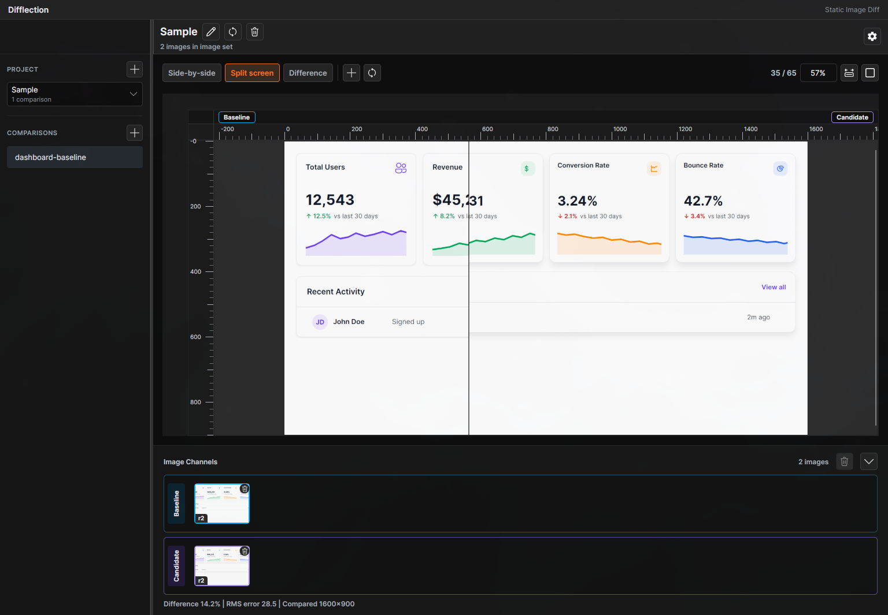
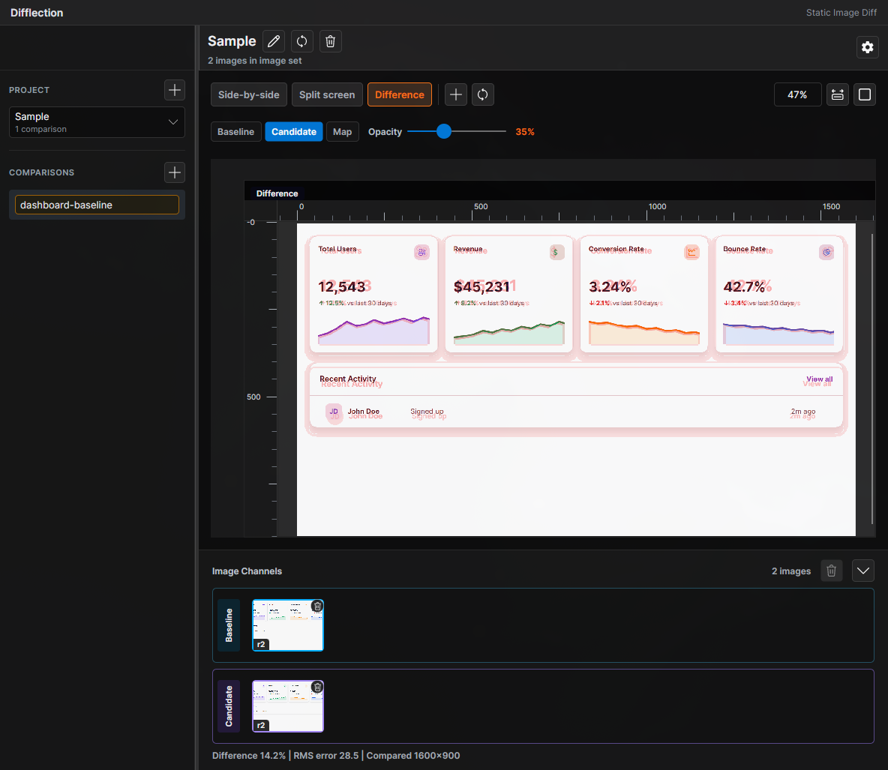

# Difflection

[](https://github.com/Zerantal/Difflection/actions/workflows/ci.yml)

Difflection is a cross-platform desktop tool for visual regression review and static image comparison, built with Avalonia and .NET.

It is designed for developers and testers who need a lightweight way to inspect UI snapshot changes without setting up a full visual-regression pipeline.

Features include:

- Side-by-side image comparison
- Split-screen comparison with draggable divider
- Difference highlighting mode
- Zoomable high-resolution inspection
- Keyboard shortcuts for common view, zoom, and file actions
- Snapshot-tested UI with Avalonia headless tests

*Side-by-side Comparison*


*Split screen comparison*


*Difference highlighting*


## Status  
This project is currently in an early alpha state. The core comparison workflow is usable, but packaging, broader file handling, accessibility polish, and error handling are still being refined.

## Technical Highlights

- Avalonia cross-platform desktop UI
- Snapshot-based UI testing
- Avalonia headless integration tests
- WebAssembly browser host scaffold
- Cross-platform .NET 10 architecture

## Downloads

Prebuilt binaries are available from the GitHub Releases [page](https://github.com/Zerantal/Difflection/releases).

## Supported Runtime

- .NET 10
- Avalonia `12.0.999-cibuild0064469-alpha`

The app is intended to be cross-platform through Avalonia, but Linux is the current development environment. Tagged releases publish Linux, Windows, and macOS (`osx-arm64`) assets; notarization is not automated yet. See [`docs/macos-release-testing.md`](docs/macos-release-testing.md) for macOS smoke-test steps.

> **Why an Avalonia alpha build?**
>
> Difflection currently uses Avalonia `12.0.999-cibuild0064469-alpha` because the latest stable Avalonia release does not provide working drag-and-drop behavior for this app on Wayland, which is the primary development platform.
>
> This CI build includes drag-and-drop fixes that work on the target Linux/Wayland environment and have also been tested successfully in the Windows release binary running under Steam/Proton.
>
> The project should move back to a stable Avalonia release once the relevant drag-and-drop fixes are available in a stable version.

## Keyboard Shortcuts

| Shortcut        | Action                |
|-----------------|------------------------------------------------------|
| `1`             | Side-by-side view                                    |
| `2`             | Split-screen view                                    |
| `3`             | Difference view                                      |
| `Ctrl + 0`      | Fit to window                                        |
| `Ctrl + 1`      | Actual size (100%)                                   |
| `Ctrl + O`      | Open files                                           |
| `F5`            | Refresh source images for the current comparison     |
| `Ctrl + F5`     | Refresh source images for the current project        |
| `Ctrl + Wheel`  | Zoom in / out                                        |
| `Shift + Wheel` | Horizontal scroll                                    |

On macOS, `Ctrl` is replaced by `Cmd` automatically — for example `Cmd + O` opens files. Tooltips on toolbar buttons reflect the platform's modifier.

## Build And Run

```bash
dotnet restore
dotnet build
dotnet run --project Difflection.Desktop/Difflection.Desktop.csproj
```

For Rider, use the launch profiles in `Difflection.Desktop/Properties/launchSettings.json` and `Difflection.Browser/Properties/launchSettings.json`.

## Browser Host

An initial Avalonia WebAssembly host lives in `Difflection.Browser`.

The project currently builds as part of the solution. Running or publishing it as WebAssembly requires the .NET `wasm-tools` workload:

```bash
dotnet workload restore Difflection.Browser/Difflection.Browser.csproj
dotnet run --project Difflection.Browser/Difflection.Browser.csproj -p:RuntimeIdentifier=browser-wasm
```

For realistic browser performance testing during development, use the `FastBrowser` flag:

```bash
dotnet run --project Difflection.Browser/Difflection.Browser.csproj -p:RuntimeIdentifier=browser-wasm -p:FastBrowser=true
```

This sets `WasmDebugLevel=0`, which disables the WebAssembly debugger support that can otherwise add substantial overhead to interactive UI paths.

For browser profiling, use the `WasmProfile` flag:

```bash
dotnet run --project Difflection.Browser/Difflection.Browser.csproj -p:RuntimeIdentifier=browser-wasm -p:WasmProfile=true
```

This enables diagnostics and Difflection-scoped WebAssembly performance instrumentation while also disabling WebAssembly debugger support.

The browser host is an early scaffold. The next browser-specific work is adapting image file/drop behavior for browser sandbox constraints.

## Test

```bash
dotnet test
```

UI snapshot baselines live in `Difflection.Tests/UI/Baselines`. Test runs write actual screenshots to `Difflection.Tests/UI/Artifacts`.

To accept updated UI snapshots:

```bash
UPDATE_SNAPSHOTS=1 dotnet test
```

## Known Limitations
- No installer or release packaging yet.
- Uses an Avalonia CI alpha build to pick up required Wayland drag-and-drop fixes.

## Roadmap

- Add first packaged release.
- Add more comparison modes if useful.
- Add directory comparison workflows
- Add CI-oriented regression review tooling
- Move back to a stable Avalonia release once the required drag-and-drop fixes are released.

## Contributing

Contributions are welcome while the project is still early. See `CONTRIBUTING.md` for local setup and development notes.

## License

Difflection is licensed under the MIT License. See `LICENSE`.
