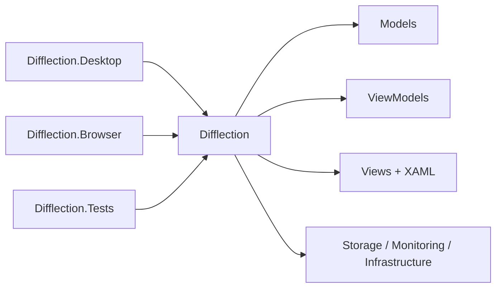

# Architecture Overview

This is a short map of the repo for new contributors.



## Projects

### `Difflection`

Shared application code used by both the desktop and browser hosts. This is where the main UI, models, view models, storage, monitoring, and infrastructure live.

| Area | Location |
| --- | --- |
| Visual layout | `Difflection/Views/*.axaml` |
| Behavior and event handlers | `Difflection/Views/*.axaml.cs` |
| UI state and app flow | `Difflection/ViewModels/*` |
| App startup | `Difflection/App.axaml.cs` |
| Desktop entry point | `Difflection.Desktop/Program.cs` |

The core desktop comparison workflow, shared model layer, and snapshot-based UI tests are the most stable parts of the repo.

### `Difflection.Desktop`

The desktop entry point. This is the normal way to run the app locally.

### `Difflection.Browser`

The WebAssembly browser host and browser-specific drag and drop bridge. This is still experimental and is mainly a scaffold for browser-hosted usage.

The browser host needs the .NET `wasm-tools` workload and has sandbox-driven file-loading limits.

### `Difflection.Tests`

Unit, UI, and snapshot tests.

Snapshot tests live in `Difflection.Tests/UI`. Baseline images and hashes live in `Difflection.Tests/UI/Baselines`, and test runs write actual images to `Difflection.Tests/UI/Artifacts`.

The tests use Avalonia headless rendering, so the UI can be rendered and compared without starting the real desktop app.

When a visual change is intentional, run:

```bash
UPDATE_SNAPSHOTS=1 dotnet test
```

Snapshot tests can be sensitive to:

* rendering backend differences
* font availability
* platform rendering changes
* Avalonia upgrades

Linux is currently the primary development and validation platform.

## Platform Caveats

- Required toolchain: .NET 10 and Avalonia `12.0.999-cibuild0064469-alpha`.
- Linux is the main development platform.
- The repo uses an Avalonia CI alpha build because it includes drag and drop fixes needed on Wayland.
- Windows packaging is present, but Windows support is still being validated in practice.
- macOS packaging is not complete yet.
- The browser host is early-stage and depends on browser sandbox constraints for file handling.
